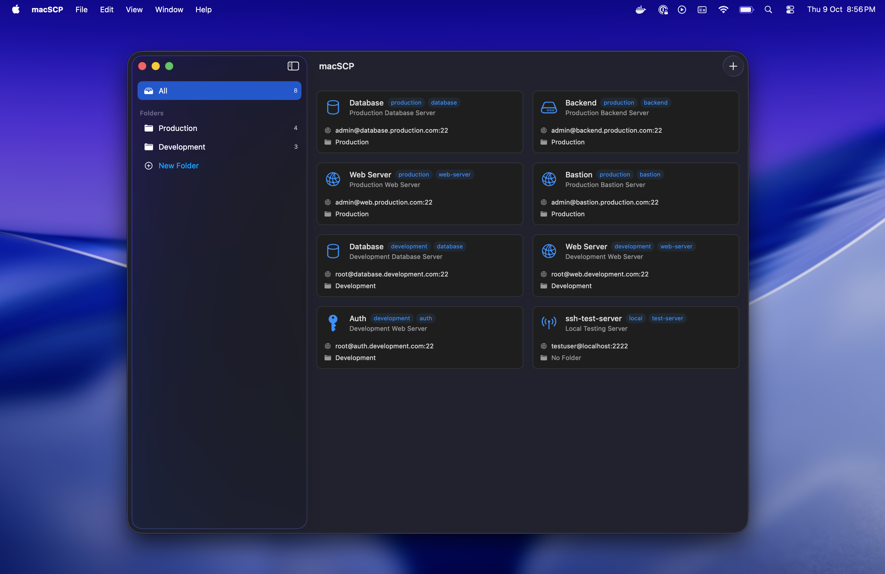
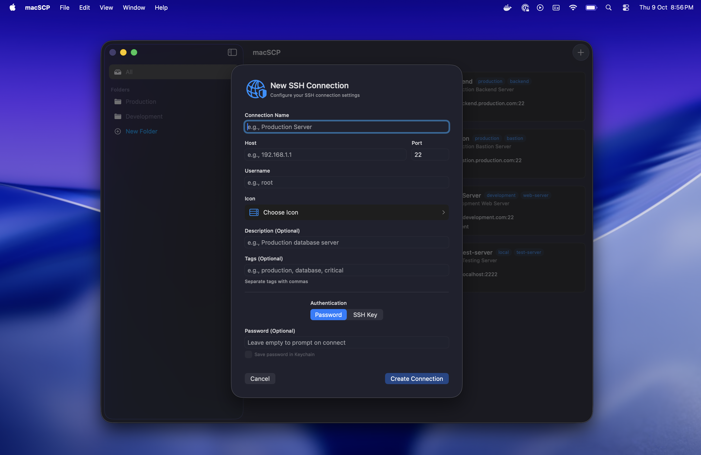
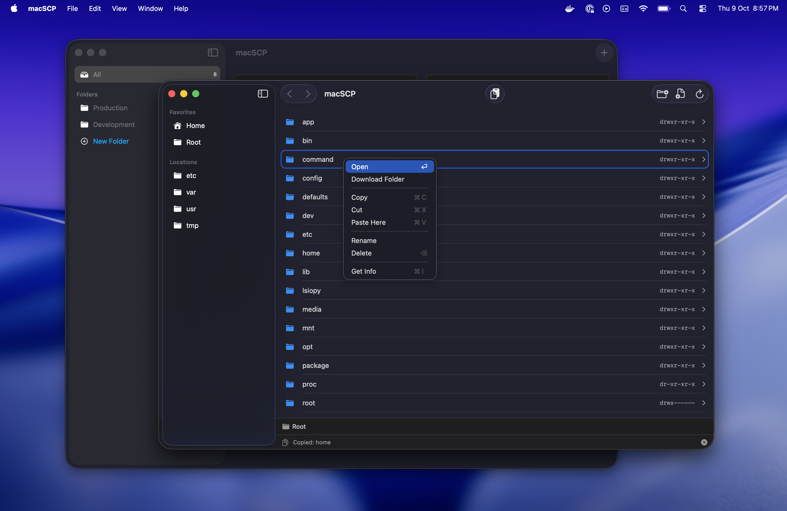
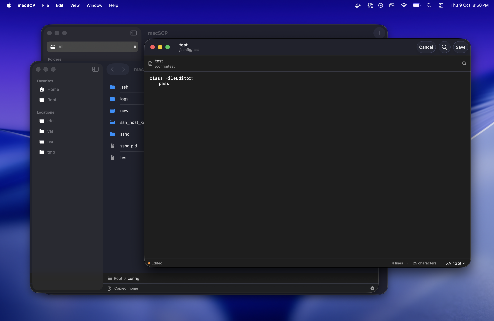

<p align="center">
  
</p>

<h1 align="center">macSCP</h1>

<p align="center">
  <strong>A native macOS SSH/SFTP client with an elegant interface</strong>
</p>

<p align="center">
  <a href="#features">Features</a> •
  <a href="#screenshots">Screenshots</a> •
  <a href="#installation">Installation</a> •
  <a href="#usage">Usage</a> •
  <a href="#building">Building</a> •
  <a href="#contributing">Contributing</a> •
  <a href="#license">License</a>
</p>

---

## Overview

macSCP is a modern, native macOS application built with SwiftUI that provides seamless SSH/SFTP file management capabilities. With its intuitive interface and powerful features, macSCP makes managing remote servers as easy as working with local files.

## Features

### 🔐 **Secure Connection Management**
- **Multiple Authentication Methods**: Support for both password and SSH key-based authentication
- **Keychain Integration**: Securely store passwords in macOS Keychain
- **SSH Key Support**: Use your existing SSH private keys for authentication
- **Connection Profiles**: Save and organize multiple server connections with custom icons and descriptions

### 📁 **Advanced File Management**
- **Full File Browser**: Navigate remote file systems with an intuitive Finder-like interface
- **File Operations**:
  - Create, delete, rename files and folders
  - Copy, cut, and paste operations with clipboard support
  - Upload and download files with progress tracking
  - Drag-and-drop file uploads
- **File Permissions**: View and understand Unix file permissions (rwxrwxrwx)
- **Quick Actions**: Context menu with common operations (Open, Download, Copy, Cut, Delete, Rename, Get Info)

### ✏️ **Built-in File Editor**
- **Syntax Highlighting**: Edit remote files directly with built-in text editor
- **Real-time Editing**: Open and modify files without downloading them first
- **Search Functionality**: Find text within files with integrated search
- **Multiple File Support**: Open multiple files in separate editor windows
- **Auto-save**: Changes are saved directly to the remote server

### 📊 **Organization & Workflow**
- **Folder Management**: Organize connections into custom folders (Production, Development, etc.)
- **Tagging System**: Tag connections for easy filtering and organization
- **Custom Icons**: Assign SF Symbols to connections for visual identification
- **Quick Search**: Filter connections by name or tags
- **Connection Counter**: See how many connections you have at a glance

### 🎨 **Native macOS Experience**
- **SwiftUI Interface**: Built entirely with SwiftUI for a modern, native feel
- **Dark Mode Support**: Fully supports macOS appearance modes
- **Multiple Windows**: Open multiple SSH sessions and file explorers simultaneously
- **Window Management**: Separate windows for file browser, editor, and file info
- **macOS Integration**: Follows macOS design patterns and conventions

### 📂 **Remote File Browser**
- **Dual Navigation**: Sidebar with favorites and locations, plus main file list view
- **File Metadata**: View file sizes, permissions, and modification dates
- **Breadcrumb Navigation**: Easy path navigation with breadcrumb bar
- **Folder Shortcuts**: Quick access to common system folders (home, root, etc.)
- **File Info Panel**: Detailed information about files and folders

### 🔄 **Transfer Operations**
- **Upload Progress**: Real-time progress tracking for file uploads
- **Download Manager**: Monitor download progress with visual feedback
- **Batch Operations**: Upload or download multiple files at once
- **Error Handling**: Clear error messages and recovery options

### 🛠️ **Developer-Friendly**
- **SwiftData Persistence**: Modern data persistence using SwiftData
- **Citadel SFTP**: Built on the robust Citadel SSH/SFTP library
- **NIO Foundation**: Leverages SwiftNIO for high-performance networking
- **Combine Framework**: Reactive programming for smooth UI updates

## Screenshots

### Connection Manager

*Manage all your SSH connections with folders, tags, and custom icons*

### New Connection Setup

*Easy-to-use connection setup with password or SSH key authentication*

### Remote File Browser

*Browse remote files with a native macOS interface, complete with context menus and file operations*

### Built-in File Editor

*Edit remote files directly with syntax highlighting and search functionality*

## Installation

### Download
1. Download the latest release from the [Releases](https://github.com/yourusername/macSCP/releases) page
2. Open the `.dmg` file
3. Drag macSCP to your Applications folder
4. Launch macSCP from Applications

### Requirements
- macOS 13.0 (Ventura) or later
- SSH access to remote servers

## Usage

### Creating a Connection

1. Click the **+** button in the top-right corner
2. Fill in your connection details:
   - **Connection Name**: A friendly name for your server
   - **Host**: Server IP address or hostname
   - **Port**: SSH port (default: 22)
   - **Username**: Your SSH username
   - **Icon**: Choose an SF Symbol icon (optional)
   - **Description**: Add notes about this server (optional)
   - **Tags**: Organize with tags like "production", "database" (optional)
3. Choose authentication method:
   - **Password**: Enter your password (optionally save to Keychain)
   - **SSH Key**: Select your private key file
4. Click **Create Connection**

### Organizing Connections

- **Create Folders**: Click "New Folder" in the sidebar to organize connections
- **Drag and Drop**: Drag connections between folders
- **Filter**: Use the "All" view to see all connections, or select a specific folder
- **Search**: Type in the search bar to filter connections by name or tags

## Building

### Prerequisites

- Xcode 15.0 or later
- macOS 13.0 SDK or later
- Swift 5.9 or later

### Dependencies

macSCP uses Swift Package Manager for dependency management. Required packages:
- [Citadel](https://github.com/Joannis/Citadel) - SSH/SFTP implementation
- SwiftNIO - High-performance networking

### Build Instructions

1. Clone the repository:
   ```bash
   git clone https://github.com/yourusername/macSCP.git
   cd macSCP
   ```

2. Open the project in Xcode:
   ```bash
   open macSCP.xcodeproj
   ```

3. Wait for Swift Package Manager to resolve dependencies

4. Select your development team in the project settings:
   - Select the project in the navigator
   - Go to "Signing & Capabilities"
   - Select your Team

5. Build and run:
   - Press `⌘R` or click the Run button
   - Or use the build script: `./create-dmg.sh`

### Creating a DMG

A build script is included to create a distributable DMG:

```bash
./create-dmg.sh
```

This will:
- Build the app in Release mode
- Create a DMG installer
- Sign the application (if configured)

## Architecture

macSCP is built with modern Swift and SwiftUI patterns:

- **SwiftUI**: Entire UI built with declarative SwiftUI
- **SwiftData**: Model persistence and data management
- **Combine**: Reactive state management
- **Citadel**: SSH/SFTP protocol implementation
- **SwiftNIO**: Non-blocking I/O for network operations
- **MVVM Pattern**: Clean separation of concerns
- **Async/Await**: Modern concurrency for smooth performance

### Key Components

- **Models**: `SSHConnection`, `ConnectionFolder`, `RemoteFile`
- **Managers**:
  - `CitadelSFTPManager` - SFTP operations
  - `FileOperationsManager` - File operations
  - `KeychainManager` - Secure password storage
  - `RemoteClipboard` - Clipboard operations
  - `NavigationManager` - Window management
- **Views**: Modular SwiftUI views for each feature

## Contributing

Contributions are welcome! Here's how you can help:

1. **Fork the repository**
2. **Create a feature branch**: `git checkout -b feature/amazing-feature`
3. **Commit your changes**: `git commit -m 'Add amazing feature'`
4. **Push to the branch**: `git push origin feature/amazing-feature`
5. **Open a Pull Request**

### Development Guidelines

- Follow Swift style guidelines
- Write clear commit messages
- Add comments for complex logic
- Test your changes thoroughly
- Update documentation as needed

## Security

macSCP takes security seriously:

- Passwords are stored securely in macOS Keychain
- SSH keys are never copied or stored
- All connections use SSH protocol encryption
- No telemetry or tracking
- All code is open source for transparency

If you discover a security vulnerability, please email security@yourcompany.com instead of using the issue tracker.

## Roadmap

Future features under consideration:

- [ ] SFTP protocol improvements
- [ ] Terminal emulator integration
- [ ] Port forwarding support
- [ ] File synchronization
- [ ] Bookmarks and favorites
- [ ] Split-pane view
- [ ] Theme customization
- [ ] Import/export connections
- [ ] Multi-tab support
- [ ] iCloud sync for connections

## Troubleshooting

### Connection Issues

- **Can't connect**: Verify host, port, username, and credentials
- **Authentication failed**: Check password or SSH key permissions
- **Timeout**: Check firewall settings and network connectivity

### File Operations

- **Permission denied**: Ensure your user has appropriate file permissions
- **Upload failed**: Check available disk space on remote server
- **Editor won't open**: Verify file is a text file and not too large

### General

- **App won't launch**: Check macOS version requirements (13.0+)
- **Crashes**: Check Console.app for crash logs and report issues

## License

This project is licensed under the MIT License - see the [LICENSE](LICENSE) file for details.

## Acknowledgments

- Built with [Citadel](https://github.com/Joannis/Citadel) by Joannis Orlandos
- Uses [SwiftNIO](https://github.com/apple/swift-nio) by Apple
- Icons from SF Symbols by Apple
- Inspired by classic SCP clients and modern macOS design

## Support

- **Issues**: [GitHub Issues](https://github.com/yourusername/macSCP/issues)
- **Discussions**: [GitHub Discussions](https://github.com/yourusername/macSCP/discussions)
- **Email**: support@yourcompany.com

---

<p align="center">
  Made with ❤️ for the macOS community
</p>

<p align="center">
  <a href="#top">Back to top</a>
</p>
